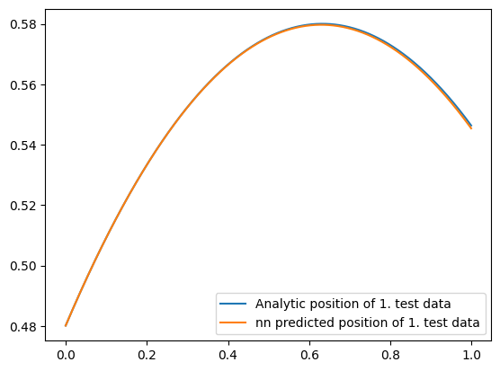
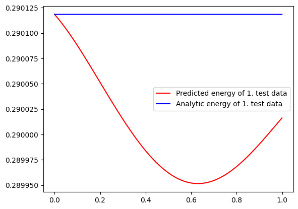
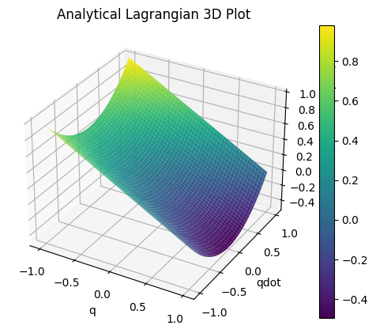
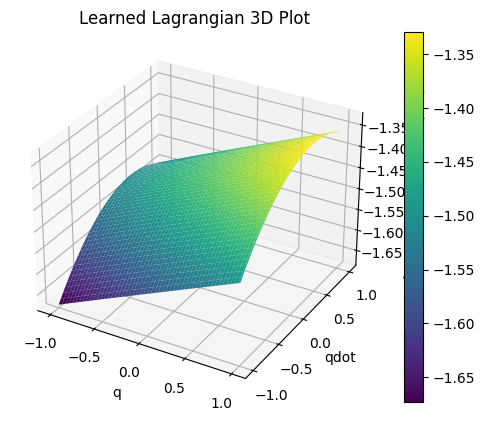
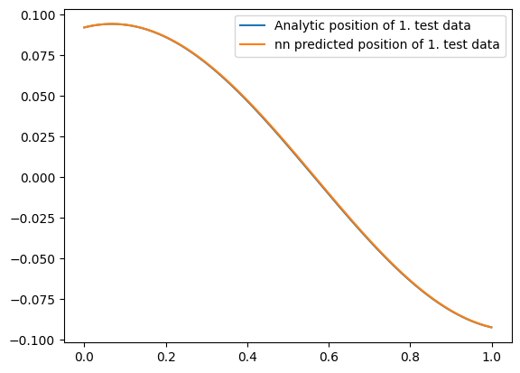
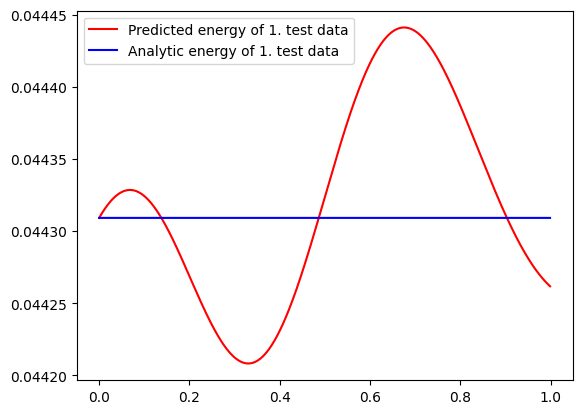
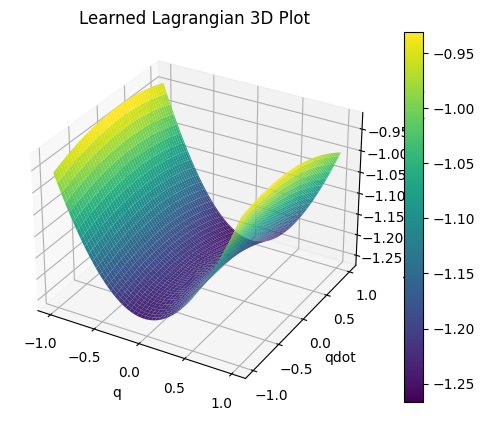

# Lagrangian Neural Networks & Symbolic Regression

This is my report of the PHYS492, Introduction to Research in Physics course, Spring 2024 semester. The project is supervised by Arkadaş Özakın.

This project focuses on the use of Lagrangian Neural Networks (LNNs) [Cranmer et al., 2020](#cranmer2020) to model and predict the dynamics of physical systems. Then, it symbolically predicts the underlying Lagrangians of these physical systems.

 Specifically, it explores three distinct physical systems: a particle under constant force, a one-dimensional harmonic oscillator, and a spring pendulum. 
 
 The study leverages the principles of classical mechanics and deep learning to construct and validate models that can effectively capture the dynamics of these systems.

 The code for this project is available on [Github](https://github.com/Ultiminati/lagrangian-nn-pytorch).

 by Abdullah Umut Hamzaoğulları

 23.05.2024


## Table of Contents
1. [Introduction](#introduction)
2. [Theoretical Background](#theoretical-background)
    - [Lagrangian Mechanics](#lagrangian-mechanics)
    - [Equations of Motion](#equations-of-motion)
3. [Methodology](#methodology)
    - [Physical Systems](#physical-systems)
    - [Data Generation](#data-generation)
    - [Model Architecture](#model-architecture)
    - [Training and Testing](#training-and-testing)
4. [Results](#results)
    - [Analytical vs LNN Solutions](#analytical-vs-lnn-solutions)
    - [Energy Conservation](#energy-conservation)
    - [Loss Metrics](#loss-metrics)
5. [Conclusion](#conclusion)
6. [Future Work](#future-work)
7. [References](#references)

## Introduction

The initial goal of this study was to add time dependence part to the Lagrangian Neural Networks (LNNs) to predict the dynamics of time-dependent systems. But while continuing with the project, the focus shifted towards getting back to the mathematical forms of the Lagrangians of the systems (i.e., symbolic regression) and conserving arbitrary symmetries.


## Timeline

I have started with the code of the LNN provided by the authors of the paper, written in JAX but the code had deprecated functions and was not working properly. (There is still an unresolved issue about this in the [Github repository of the paper](#cranmergithub))

 I have spent lots of time to fix the code and make it work but I was not experienced in JAX, so I decided to downgrade both the libraries and the Python version as well. First, this forced me to work on my local computer. Also, the models were still not training properly and there were a lot of redundant and duplicate Python files, so I decided to look for alternatives or start from scratch. 
 
 I have found [a PyTorch implementation of the LNNs](#magnusross) and decided to use that. I have started to work on the project from that repository. But this code was producing infinite values, was not open to change of the physical systems and the training data. So first, I have fixed the code by introducing normalization. Then, I added customization of the physical systems and the training / testing data. After that, I introduced better plottings. Finally, I experimented with the symbolic regression part. 

 The code in the final form is fully functional and customizable. It can be used to train and test the LNNs for the physical systems and can be used to predict the Lagrangians of the systems. Adding new physical systems is very easy, there are some functions that needs to be implemented inside a class and the code will take care of the rest.


## Theoretical Background

### Lagrangian Mechanics

Lagrangian mechanics is a reformulation of classical mechanics introduced by Joseph-Louis Lagrange. It describes the dynamics of a system using the Lagrangian function, $\mathcal{L}$, defined as the difference between the kinetic energy, $T$, and the potential energy, $V$, of the system is usually in the form of kinetic minus potential, i.e.,
$\mathcal{L} = T - V$

### Equations of Motion

The equations of motion for a system can be derived using the Euler-Lagrange equation:

$\frac{d}{dt} \left( \frac{\partial \mathcal{L}}{\partial \dot{q}} \right) - \frac{\partial \mathcal{L}}{\partial q} = 0$

Reformulating this equation with the vector form (for time-independent systems) gives:

$\ddot q = (\nabla_{\dot q}\nabla_{\dot q}^{\top}\mathcal{L})^{-1}[\nabla_q \mathcal{L} - (\nabla_{q}\nabla_{\dot q}^{\top}\mathcal{L})\dot q]$

For the systems considered in this study, the Lagrangian and resulting equations of motion are derived and solved both analytically and using LNNs.

## Methodology

### Physical Systems

Three physical systems were considered in this study:

1. **Constant Force Particle**: A particle subjected to a constant gravitational force.
2. **1D Harmonic Oscillator**: A mass-spring system oscillating in one dimension.
3. **Spring Pendulum**: A pendulum with a spring, where both the spring length and the angle of the pendulum can vary.

An example of how a physical system is defined in the code is as follows:

```python
class harmonic_oscillator_spring_1d:
    
    def __init__(self, m, k):
        self.m = m
        self.k = k
        self.dof = 2
        self.toy_position_example = np.array([0.3])
        self.toy_velocity_example = np.array([1.0])
        self.toy_time_dataset = np.arange(0, 4, 0.001)
        self.position_bounds = (-1,1)
        self.velocity_bounds = (-2,2)

    def scale_constants(self, scale):
        pass
        
    def kinetic(self, x):
        return 0.5 * self.m * x[1]**2
    
    def potential(self, x):
        return 0.5 * self.k * x[0]**2
    
    # NEED LAGRANGIAN TO PRODUCE SCALARS, NOT TENSORS!
    def lagrangian(self, x):
        T = self.kinetic(x)
        V = self.potential(x)
        return T - V
    
    def energy(self, x):
        T = self.kinetic(x)
        V = self.potential(x)
        return T + V
    
    def solve_acceleration(self, q, qdot):
        return -self.k * q / self.m
    
    def plot_solved_dynamics(self, t, path, labelstr = ""):
        plt.plot(t, path[:, 0], label = labelstr)

    def plot_lagrangian(self, t, path, lagrangian, labelstr = ""):
        plt.plot(t, [lagrangian(l) for l in path], label = labelstr)
```


### Data Generation

Synthetic data was generated for each system by solving the equations of motion analytically using `scipy.integrate.odeint`. The data includes the positions and velocities of the systems over time, which were used to train and test the LNN models.

The training data was generated by solving the equations of motion for random initial conditions. The validation data was generated using a few randomized initial conditions to test the generalization of the model.

The hyperparameters for the data generation, such as the number of trajectories, time steps is easily customizable in the code.


### Model Architecture

The LNN model consists of three fully connected layers:

- **Input Layer**: Takes the state vector $[q, \dot{q}]$ as input.
- **Hidden Layers**: Two hidden layers with 128 neurons each, using the `softplus` activation function.
- **Output Layer**: Produces a single scalar output representing the Lagrangian.

The prediction is *not* the Lagrangian itself, but the acceleration, derived from the Lagrangian using Euler-Lagrange equation written above.

### Training and Testing

The model was trained using the Adam optimizer and the mean absolute error (MAE) loss function between the actual acceleration and the predicted acceleration. A scheduler was used to reduce the learning rate when the loss plateaued. The training process involved:

1. **Normalizing the Data**: Scaling the input and output data to ensure numerical stability. Scaling the data was the key to make the model work properly. But one needs to be careful when scaling physical systems, because the scaling can change the physical properties of the system. For example, for the constant gravitational force example, we also need to modify g (the gravitational acceleration) when scaling the data to keep the physical properties of the system.

2. **Training the Model**: Training the model for a specified number of epochs and validating its performance.

## Results

The testing was done in constant force particle system and 1D harmonic oscillator. The results are as follows:

### Constant Force Particle

#### Analytical vs LNN Solutions

The dynamics of the systems were solved analytically and using the LNN model. The solutions were compared by plotting the trajectories and calculating the mean squared error between the predicted and actual states. Only the first test trajectory is shown below:




#### Energy Conservation

The energy of the system was computed at each time step for both the analytical and LNN solutions. The conservation of energy was used as a metric to evaluate the physical accuracy of the LNN model. The energy plots for the first test trajectory are shown below:



#### 3d Plots of Lagrangians
The 3d plots of the Lagrangians are shown below:





#### Symbolic Regression of Lagrangians

Only the difference between the two Lagrangians were printed as LateX code. The difference between the two Lagrangians: ($x_{0}$ is the position, $x_{1}$ is the velocity)

$- 0.592 x_{0} + x_{1} \cdot \left(0.589 x_{1} - 0.0667\right) + 1.43$

The scale is different and there is an extra constant term and a term with $x_{1}$, which is a total time derivative, so the symbolic regression has generalized the Lagrangian predicted by the LNN.


### 1D Harmonic Oscillator

#### Analytical vs LNN Solutions

The dynamics of the systems were solved analytically and using the LNN model. The solutions were compared by plotting the trajectories and calculating the mean squared error between the predicted and actual states. Only the first test trajectory is shown below:




#### Energy Conservation

The energy of the system was computed at each time step for both the analytical and LNN solutions. The conservation of energy was used as a metric to evaluate the physical accuracy of the LNN model. The energy plots for the first test trajectory are shown below:



#### 3d Plots of Lagrangians
The 3d plots of the Lagrangians are shown below:




#### Symbolic Regression of Lagrangians

Only the analytical Lagrangians and the difference between the two Lagrangians were printed as LateX code. 

The analytical Lagrangian: 

$-5.0x_{0}^{2} + 0.5x_{1}^{2}$

The difference between the two Lagrangians: ($x_{0}$ is the position, $x_{1}$ is the velocity)

$- 5.29 x_{0}^{2} + 0.532 x_{1}^{2} + 1.22$

The scale is different, although very close. There is only an extra constant term, so the symbolic regression very successfully generalized the predicted Lagrangian of the system.

## Conclusion

This study confirms that LNNs can effectively model and predict the dynamics of physical systems while adhering to the underlying physical laws. The LNN model was able to produce accurate predictions and conserve energy, validating the approach. But when trying to have long time predictions, the model fails to conserve energy in my experiments. This issue may be resolved by using more sophisticated neural network architectures or training strategies.

For the symbolic regression part, analytically provided Lagrangians were predicted exactly correctly. The Lagrangians from the LNN included some additional terms that were not in the analytical Lagrangians.

There is the freedom of adding arbitrary total time derivatives of functions of the generalized coordinates and time, so when the additional terms were checked, they were found to be the total time derivatives of the generalized coordinates and time. So, the project was successful in predicting the Lagrangians of the systems (at least, symbolic regression generalized the Lagrangians correctly).

As my first computational research experience, I learned how to clean up and implement a code base and how to progress with such a research project. I also learned how to use PyTorch, and a little bit about symbolic regression, using PySR library.

I am thanking my supervisor, Arkadas Ozakin for his guidance and support throughout the project.

## Future Work

Future work could explore:
- Using symbolic regression starting from the model itself instead of the data.
- Applying the LNN approach to real-world experimental data, then trying to get back the mathematical forms of the Lagrangians.
- Thinking of a way to conserve arbitrary symmetries.
- Extending the LNN framework to more complex and higher-dimensional systems.
- Hyperparameter tuning and model optimization to improve the accuracy and generalization of the LNN models.

## References

- <a id="cranmer2020"></a>Cranmer, M., Greydanus, S., Hoyer, S., Battaglia, P., Spergel, D., & Ho, S. (2020). Lagrangian Neural Networks. arXiv preprint arXiv:2003.04630.

- <a id="cranmergithub"></a> Github repository of the original paper for LNNs https://github.com/MilesCranmer/lagrangian_nns

- <a id="magnusross"></a> Pytorch Implementation of the LNNs https://github.com/magnusross/pytorch-lagrangian-nn


---
